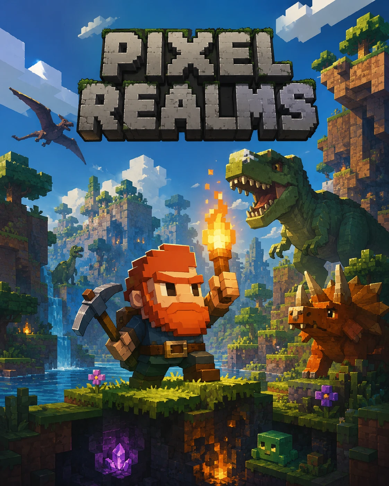

# ⛏ Pixel Realms

<p align="center"></p>

**Aventura 2D de minería y exploración (tipo Terraria) — *Vethrún, el mundo hueco*** · Pixel art · *(el modo isométrico clásico sigue en el código, oculto del menú por ahora)*

Un juego de supervivencia, construcción y cooperación para navegador hecho **solo con JavaScript vanilla**: cero dependencias, cero assets externos. Cada sprite — tiles, árboles, el héroe, los monstruos, los edificios — se dibuja píxel a píxel por código al arrancar. El sonido se sintetiza con WebAudio. Y el multijugador corre sobre un **WebSocket implementado a mano** (handshake SHA-1 y frames RFC 6455 sobre `net`/`http` de Node).

**📖 [Guía del mundo (wiki autogenerada)](wiki.html) · 🚀 [Plan de despliegue VPS + cuentas](DEPLOY.md)**

## 🎮 Jugar

**Un jugador:** abre `index.html` en el navegador, o juega en GitHub Pages. Ya está.

**Multijugador cooperativo:**

```bash
node server.js
# → http://localhost:5173  (cada visitante entra al MISMO mundo)
```

Cualquiera que abra esa URL verá el botón **«Entrar al mundo compartido»**. Para jugar con gente fuera de tu red, despliega `server.js` en cualquier hosting de Node (Render, Fly.io, Railway, un VPS…) o comparte tu puerto con un túnel (Tailscale, ngrok). El mundo se guarda en `world-server.json` y sobrevive a los reinicios.

## ✨ Características

- **Dos modos de juego seleccionables desde el menú**:
  - 🏔 **Isométrico** — el mundo abierto cooperativo de siempre (vista 2:1, exploración, aldeas, construcción, multijugador).
  - ⛏ **2D lateral (tipo Terraria)** — ambientado en **Vethrún, el mundo hueco** ([lee el lore](LORE.md)): un mundo de columnas con gravedad real, dinosaurios (herbívoros pacíficos y carnívoros hostiles), y la **Puerta Abisal** —una estructura que fabricas, colocas e **invocas con clic derecho para descender** de estrato en estrato hacia el Corazón del mundo, donde te esperan el cristal abisal y peligros mayores. Además: cavas hacia abajo, descubres **cuevas** y **vetas de carbón y hierro**, construyes y saltas por plataformas. Protagonista nuevo: un **enano minero** animado (sprite pixel CC0). **Fondos con profundidad** que cambian según el bioma en superficie (montañas, bosque de pinos, dunas con cactus, nieve) y se vuelven **cueva** bajo tierra, con halo de visión. **Física de bloques** (no puedes colocar nada flotando), solo picas el bloque **justo delante**, y los bloques se **agrietan progresivamente** hasta romperse. Texturas pixel externas **CC0** (ver [CREDITS.md](CREDITS.md)). Comparte inventario, items, crafteo, audio y guardado con el modo iso. (Single-player por ahora.)
- **Mundo infinito por chunks** con biomas de ruido fractal determinista: océanos, praderas, bosques (con árboles frutales), desiertos, tundras y montañas. La misma semilla genera siempre el mismo mundo.
- **Render HD "Diorama iluminado"**: el mundo se dibuja a resolución nativa y suavizada (adiós al escalado pixelado) y pasa por una cadena de post sobre Canvas 2D — **bloom** de altas luces (fuegos, horno, altar, agua y atardecer "sangran" luz), **oclusión de contacto** y **sombras direccionales** que siguen al sol, **agua reflectante** (refleja el cielo, especular animado y espuma de orilla), **rim light** de luna y **tilt-shift** que convierte la escena en una maqueta. Todo procedural, sin dependencias, con tres niveles de calidad (`CFG.GFX`).
- **Vista isométrica 2:1** con orden de profundidad, cámara suave e iluminación nocturna real (las luces abren agujeros en la oscuridad).
- **Cámara cercana estilo Stardew** con tres niveles de zoom (`+`/`−`) y suelos a doble resolución de píxel.
- **Editor de personaje**: piel, peinado, color de pelo, camiseta y pantalón — tu héroe te representa también online.
- **Héroe en alta definición**: cuádruple densidad de píxel, ciclo de andar de 4 pasos con aceleración real, pose de ataque con la herramienta en la mano, medio cuerpo sumergido al vadear y polvillo en los pies.
- **Personajes vivos (animación procedural)**: sin un solo sprite nuevo, héroe, comerciantes, otros jugadores y criaturas **respiran** al estar quietos, **botan y se inclinan** hacia donde corren, hacen **recoil** al golpear y **acusan** el daño con un aplaste; los slimes son gelatinosos, los murciélagos baten alas y los comerciantes gesticulan según su oficio. Todo deformando el sprite alrededor de los pies (la sombra nunca se despega), a coste casi nulo.
- **Ciclo día/noche cinematográfico**: el cielo vira de color a lo largo del día —amanecer dorado, mediodía neutro, atardecer ámbar, anochecer violáceo y noche azul profunda con estrellas que titilan—, y el velo de oscuridad se tiñe según la hora.
- **Atmósfera viva**: la vegetación (árboles, hierba, flores, cultivos) se mece con ráfagas de viento; motas de polen flotan a contraluz de día; luciérnagas vagan y parpadean de noche; ascuas ascienden de fuegos, hornos y antorchas; y una viñeta cinematográfica enmarca la escena.
- **Clima dinámico**: lluvia, **tormentas** con relámpagos y truenos, y **nieve** en los biomas fríos (tundra y alta montaña). La lluvia encapota el cielo, arrecia el viento y **riega tus cultivos** para que crezcan más rápido.
- **Ruinas antiguas**: anillos de muros derruidos con una antorcha eterna, esperando a quien explore lejos.
- **Recolección y crafteo**: hacha, pico y espada; tablones, antorchas, fogatas, muros.
- **Construcciones prefab estilo SimCity** (pestaña «Construcciones» del panel):
  - 🏠 **Cabaña** — fija tu punto de reaparición
  - 🏹 **Torre arquera** — dispara flechas sola a los monstruos
  - 🪚 **Aserradero** / ⛏ **Cantera** / 🫐 **Huerto** — producen recursos con el tiempo; recógelos con clic derecho
  - 🔥 **Brasero** — un gran círculo de luz nocturna
  - 🗿 **Altar antiguo** — invoca al jefe… si te atreves
- **Movimiento estilo MOBA (clic para ir)**: clic izquierdo y el héroe va solo —con pathfinding A\* que rodea obstáculos— a caminar, talar, atacar o hablar; mantenlo pulsado para arrastrarte. WASD sigue disponible.
- **Aldeas con comerciantes**: pueblos procedurales (casas, plaza, pozo, faroles) habitados por **herborista, cantero, carpintero y mercader**, cada uno con su nombre, aspecto y personalidad. Habla con ellos y comercia con monedas. El diálogo usa respuestas procedurales y, si conectas un modelo (Gemma vía Ollama o Google AI), conversación con IA de verdad — ver [DEPLOY.md](DEPLOY.md).
- **Recados (quests)**: cada comerciante te encarga traerle materiales a cambio de monedas y, a veces, una herramienta. Un tracker en el HUD muestra el progreso.
- **Descubrimiento**: una brújula **⚑** te guía a la aldea más cercana y el minimapa marca aldeas, comerciantes y otros jugadores — para no perderte en un mundo infinito.
- **Granja**: ara la tierra con la azada, planta semillas (de hierba y arbustos), míralas crecer en cuatro fases y cosecha comida.
- **Minería y herrería**: pica vetas de **carbón** y **hierro** en las montañas, funde el mineral en un **horno** y fabrica herramientas de hierro (tier 2) que talan y pican más rápido.
- **Modo creativo**: recursos infinitos (paleta con todos los objetos), construir y romper al instante, sin daño ni enemigos. Ideal para probar y diseñar.
- **Tres enemigos nocturnos**: babas saltarinas, sombras que caminan sin descanso (sueltan esencia oscura) y murciélagos que vuelan sobre tus muros.
- *(El jefe «Coloso de Baba» está retirado de momento; su código queda dormido tras `CFG.BOSS_ENABLED`.)*
- **Multijugador cooperativo sin PvP**:
  - Chat integrado (tecla `T`) con bocadillos sobre los jugadores.
  - **Lo que construyes es tuyo**: cualquiera puede *usar* tu huerto, tus torres o calentarse en tu fogata, pero solo tú puedes destruirlo.
  - El Coloso escala su vida con los jugadores conectados: es el enemigo de todos, y al caer llueve botín para todos.
  - Bonus «calor de hogar»: regeneras el doble junto a una hoguera con compañía.
  - Reloj y mundo compartidos y persistentes en el servidor.
- **Guardado automático** en localStorage (un jugador) y en `world-server.json` (servidor).

## ⌨ Controles

| Control | Acción |
|---|---|
| **Clic izquierdo** | Ir ahí · talar/picar · atacar · hablar con comerciantes (estilo MOBA) |
| Clic izquierdo (mantener) | Arrastrar para moverte |
| **Clic derecho** | Colocar · comer · recoger producción |
| **`Espacio`** | **Saltar** (iso: arco con peso, sobrevuela charcos; 2D: salto de plataformas con altura variable) |
| `WASD` / flechas | Moverse a mano (en el modo 2D, `A`/`D` para correr) |
| **Clic (modo 2D)** | Izquierdo: **picar** el tile apuntado · Derecho: **colocar** el material seleccionado |
| `1–9` / rueda | Seleccionar en la barra rápida |
| `E` | Inventario, fabricación y construcciones |
| `T` | Chat (online) |
| `+` / `−` | Acercar o alejar la cámara |
| `H` | Ayuda · `M` Silenciar |

## 🧱 Cómo está hecho

```
index.html
css/style.css        UI retro (Press Start 2P, marcos pixelados)
js/
  utils.js           hash determinista, ruido de valor, fBm
  config.js          datos: tiles, objetos, items, recetas, enemigos, jefe
  assets.js          TODO el pixel art, generado en canvas al vuelo
  audio.js           sintetizador WebAudio
  world.js           chunks infinitos + biomas + edificios + ruinas + aldeas (modo iso)
  world2d.js         mundo 2D por columnas: superficie, cuevas y vetas (modo Terraria)
  path.js            pathfinding A* acotado para el click-to-move
  inventory.js       inventario y crafteo
  entities.js        jugador, enemigos (3 IAs), jefe, flechas, drops
  npc.js             comerciantes: aparición por aldea, diálogo (LLM/procedural), comercio
  input.js           teclado, ratón y chat
  renderer.js        proyección isométrica, culling, luces, jugadores remotos
  side.js            modo 2D: física de plataformas (gravedad/AABB), cámara y render laterales, picar/colocar
  ui.js              HUD, paneles, minimapa, chat, barra del jefe
  save.js            persistencia local (un jugador y por-mundo online)
  net.js             cliente multijugador
  main.js            bucle, día/noche, producción, torres, Noche del Coloso
server.js            estáticos + WebSocket artesanal + autoridad del mundo
tools/bot.js         bot de pruebas del multijugador
```

Sin build, sin framework, sin `npm install`. Nada de dependencias: ni en el cliente ni en el servidor.

## 🗺 Hoja de ruta

- [x] Construcciones con función (producción, defensa, luz, respawn)
- [x] Multijugador con chat y propiedad de construcciones
- [x] Movimiento click-to-move con pathfinding
- [x] Aldeas con comerciantes (diálogo + comercio; IA opcional con Gemma)
- [x] Recados de los comerciantes (con recompensa)
- [x] Descubrimiento: brújula y marcadores de aldea en el minimapa
- [x] Granja (arar, plantar, cosechar)
- [x] Minerales (carbón, hierro), horno y herramientas de hierro
- [x] Modo creativo
- [x] Fauna pasiva (conejos y ciervos), carne y cocinar
- [x] Atmósfera: ciclo de color día/noche, viento, partículas ambientales y viñeta
- [x] Clima dinámico (lluvia, tormentas con relámpagos, nieve por bioma)
- [x] Modo 2D lateral tipo Terraria (mundo por columnas, gravedad, cuevas, minerales, picar/colocar)
- [ ] Cuentas Google (Firebase) y partidas en la nube — ver [DEPLOY.md](DEPLOY.md)
- [ ] Reintroducir el jefe como evento opcional
- [ ] Soporte táctil para móvil

## Licencia

[MIT](LICENSE)
